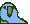

<!-- 

  
👋 **Hola**

  

  
My name is Konv Suu and I'm a front-end developer.

❤️ **Technologies**

*Keep studying hard* 

🗒️ **Currently learning**

  

🌈 **Github Status** 
  

 

  
  
  
  
  
  
  
  
  

 -->

## Hi, I'm Konv Suu.

I hope that in 2023, I can have contributions on Github every day.