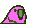

<p align="center">
  
  
  
  
  
  
  
  
  
</p>

## 😎 About me...

```ts
const me = {
  name: string = 'Konv Suu';
  born: number = 2001;
  pronouns: string[] = ['he', 'him'];
  location: string = 'Changsha, China';
  languages: string[] = ['Chinese', 'English'];
  hobbies: string[] = ['Coding', 'UI Design', 'Gaming'];
  skills: string[] = ['Vue', 'TypeScript'];
}

```


## 💕 Languages and Tools


## 🔔 My Latest GitHub Activity

<!--START_SECTION:activity-->
1. 💪 Opened PR [#1499](https://github.com/IDuxFE/idux/pull/1499) in [IDuxFE/idux](https://github.com/IDuxFE/idux)
2. 💪 Opened PR [#1498](https://github.com/IDuxFE/idux/pull/1498) in [IDuxFE/idux](https://github.com/IDuxFE/idux)
3. 🎉 Merged PR [#1](https://github.com/kovsu/ChatGPT-demo/pull/1) in [kovsu/ChatGPT-demo](https://github.com/kovsu/ChatGPT-demo)
4. 🗣 Commented on [#1436](https://github.com/IDuxFE/idux/issues/1436) in [IDuxFE/idux](https://github.com/IDuxFE/idux)
5. 🗣 Commented on [#2837](https://github.com/vueuse/vueuse/issues/2837) in [vueuse/vueuse](https://github.com/vueuse/vueuse)
<!--END_SECTION:activity-->


## 📈 Github Stats

<a href="https://github.com/kovsu/kovsu">
  
</a>
<a href="https://github.com/kovsu/kovsu">
  
</a>
